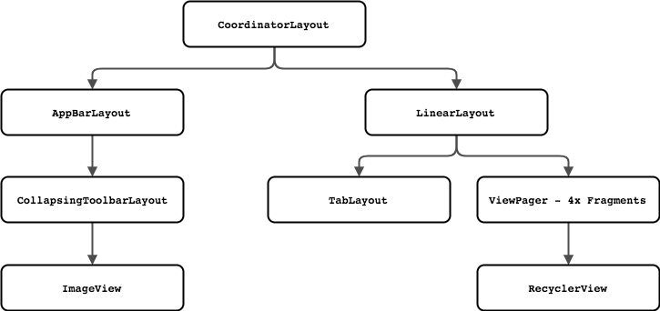
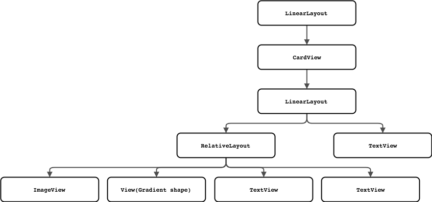

**App Presentation**  

  

**Details**

01/05/18: Initiate Commit.  

This project is an Android App that indroduces Guangzhou city in four categories which are Top Spots, Restaurants, Hotels and Things to buy. And each category contains six items that display an photo and the name, type, address of that item.  
The layout of the App is rich. CoordinatorLayout, AppBarLayout, CollapsingToolbarLayout, TabLayout, Fragment, RecyclerView and CardView are implemented. Besides, there are two different layout for the Portrait and Landscape mode of the device. The hierarchy is displayed below.  

**The hierarchy of main screen:**  
  

**The hierarchy of each card:**  
  

The key words of this project in Java will be ViewPager & CategoryAdapter, TabLayout & OnTabSelectedListene, AppBarLayout & addOnOffsetChangedListener, Animation & AnimationListener, RecyclerView & setOnItemClickListener. The Code explanation will be on my [blog](https://www.jianshu.com/p/d58ea44d7e1f), go check that out.  

Note:  
1. The images in the AppBar source: [German Kopytkov on Dribbble](https://dribbble.com/Kopytkov)
2. The images in the Card are collected through Google Image Search.   
If there are any copyright violation, please contact me and I'll take them down. 
3. The style of the app is largely based on Google Trips App. 

This is a training project in Udacity's Android Basics Nanodegree program.  
Check out this and other courses here: https://www.udacity.com/courses/all
